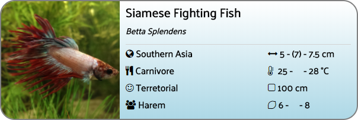

# Fish labeler


Example:




```json
"swordtail": {
    "name": "Swordtail",
    "latin_name": "Xiphophorous Hellerii",
    "length": {
      "min": "",
      "max": "",
      "avg": 11
    },
    "image_url": "https://www.petsolutions.com/images/Products/13500.jpg",
    "region": "Central America",
    "group_size": "Harem",
    "temper": "Peaceful",
    "min_aquarium_size": 80,
    "food_type": "Omnivore",
    "temps": {
      "min": 23,
      "max": 28,
      "ideal": 24
    },
    "pH": {
      "min": 7,
      "max": 8,
      "ideal": ""
    }
  }
  ```
